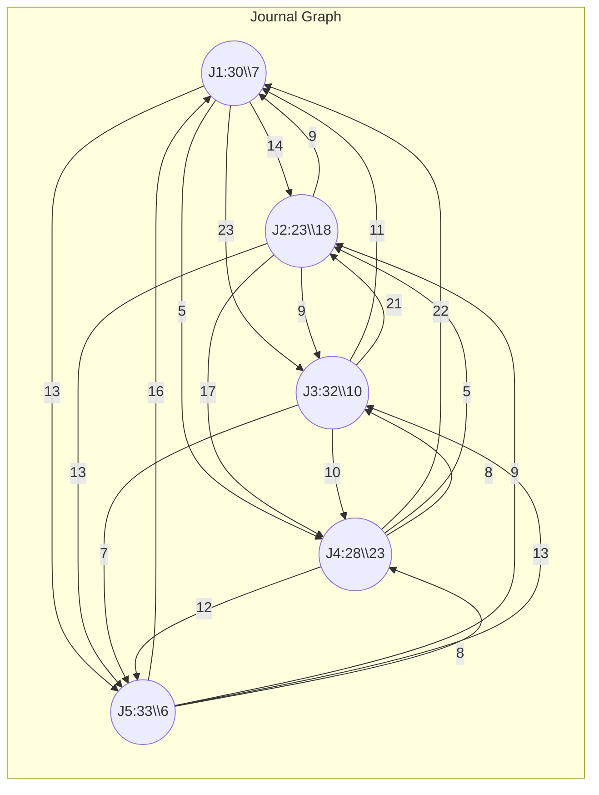

> 他山之石，可以攻玉

### 期刊影响因子

期刊影响因子（Journal Impact Factor, 
JIF）是一个反映期刊在学术界影响力的常用指标。它由科睿唯安（Clarivate 
Analytics）在其 **《期刊引证报告》（Journal Citation Reports, JCR）** 
中发布。影响因子的计算方法基于期刊文章在特定时间段内的被引用次数。

#### 影响因子的计算公式

期刊影响因子的计算公式为：


$$
\text{影响因子} = 
\frac{\text{某期刊在前两年内发表文章在当前年被引用的总次数}}{\text{该期刊在前两年内发表的文章总数}}
$$


#### 具体步骤

1. **选择时间段**: 
通常选择某个期刊在过去两年的发表文章作为基准。例如，计算某期刊2023年的影响因子时，选择该期刊2021年和2022年发表的文章作为基准。

2. **统计引用次数**: 
计算2021年和2022年发表的所有文章在2023年被引用的次数。

3. **统计发表的文章总数**: 
统计该期刊在2021年和2022年发表的可被引用的文章总数（通常包括研究论文、综述等，但不包括社论等不可引用的内容）。

4. **计算影响因子**: 
用2023年引用2021年和2022年发表的文章的总引用次数，除以2021年和2022年发表的文章总数，得到该期刊的影响因子。

#### 示例

假设某期刊在2021年和2022年共发表了200篇文章，这些文章在2023年被引用了1000次。则该期刊2023年的影响因子为：

$$
\text{影响因子} = \frac{1000}{200} = 5.0
$$

#### 影响因子的作用

- **评价期刊的影响力**: 
影响因子常用于衡量学术期刊的学术影响力和质量，高影响因子的期刊通常被认为具有较高的学术声望。
- **学者投稿参考**: 
学者选择投稿期刊时，通常会参考期刊的影响因子，以增加其研究工作的影响力。
- **科研评价**: 
影响因子也被用于科研人员、机构和学术成果的评价，但应注意，影响因子仅能反映期刊整体的引用情况，不应单独作为评价学术质量的唯一标准。

#### 注意事项

目前的期刊评价指标（如影响因子）虽然广泛使用，但也存在一些问题和局限性，主要表现在以下几个方面：

1. **过度依赖影响因子**

   
影响因子作为衡量期刊学术影响力的指标，常被视为期刊质量和影响力的主要衡量标准。然而，它只统计期刊两年内的平均引用次数，因此不能全面反映期刊的学术水平。**过度依赖影响因子**可能忽视了其他重要的学术贡献和科研成果。

2. **学科差异性**

   
不同学科的引用习惯差异巨大。例如，生命科学、物理学等领域的论文引用频率较高，而人文社科类论文引用率较低。因此，不同学科之间的期刊影响因子不可直接比较。**高影响因子并不一定意味着在所有领域的影响力都大**。

3. **被高引用文章拉高影响因子**

   
某些期刊的影响因子可能受到个别**高引用文章的极大影响**，从而不能真实反映整个期刊的整体水平。个别热门文章或者综述类文章通常引用量极高，这会人为拉高期刊的影响因子。

4. **短期关注**

   
影响因子只考虑前两年的引用次数，而许多学术成果可能需要更长的时间才能被广泛引用或认可。因此，影响因子倾向于反映**短期的学术影响力**，对长远学术贡献的衡量不足。

5. **自引问题**

   
一些期刊通过**自引**（引用自己期刊中的文章）来提高影响因子，虽然自引并不完全是恶意的，但过度自引会影响影响因子的客观性和公正性。

6. **质量与数量混淆**

   
影响因子只关心引用次数，而不关心被引用的内容是否具备高质量。某些低质量或错误的文章也可能被大量引用（例如，为了批判或质疑），但这些引用并不代表文章的学术价值。因此，**影响因子没有衡量文章的实际学术质量**。

7. **忽视文章个体质量**

   
影响因子衡量的是**期刊的整体水平**，而非个别文章的质量或影响力。一些学者发表在高影响因子期刊的文章未必一定是高质量的，而发表在低影响因子期刊的文章也可能具有重大的学术价值。**过度关注期刊影响因子可能影响学术评价的客观性**。

8. **推动学术功利主义**

   
由于影响因子被广泛用作科研人员的考核标准，学者们往往更倾向于**投稿高影响因子期刊**，甚至为迎合期刊的要求而改变研究方向。这种现象会导致科研中的功利主义，影响真正的科研创新和多样性。

9. **忽视开放获取期刊**

   
传统影响因子评估体系常偏向于付费的封闭期刊，而忽视了**开放获取期刊**，即使这些期刊可能具有同样高的学术影响力。

#### 改进方向

为了解决这些问题，学术界提出了一些新的评价指标和多维度的评价体系。例如：
- **h指数**（h-index）：衡量学者长期的学术影响力。
- **文章级别的影响力测量**（Article-Level 
Metrics）：注重单篇文章的引用与影响，而非期刊整体。
- 
**社会影响因子**：考虑文章在学术圈外的传播与影响（例如社交媒体上的讨论、政策引用等）。

通过多元化的评价标准，能够更全面地反映科研成果的实际学术价值和社会影响。

### 引用结构建模

从影响因子的计算方式上来看，发文数和引用数是很重要的统计数据。但是，这些数据仅仅衡量了单个期刊的指标。尤其是引用数据，期刊之间的引用结构没有一并体现出来。为了更直观地反映期刊之间的引用关系，需要对这些引用结构进行建模。

#### 期刊引用关系有向图

图结构能够很好地对引用关系进行建模，有向图由顶点和边组成，**我们把每个期刊抽象成一个顶点，把一个期刊A对另一个期刊B的引用抽象成一条从A出发指向B的边，这样我们就得到了一个包含各个期刊之间引用结构的有向图表示**。下面给出了一个简单的示例：



图中包含5个期刊`J1、J2、...、J5`，同时还有20条边。顶点和边都有与之相关的权重，我们将这些权重定义如下：

+ **点权**：为该期刊在前两年内发表文章在当前年被*期刊本身*引用的总次数
+ 
**边权**：有向边从顶点A到顶点B的权重为期刊B在前两年内发表文章在当前年被期刊A引用的总次数

除此之外，我们还可以对顶点加入其它属性的描述，如每个顶点属性中加入该期刊在前两年内发表的文章总数。在有向图表示的基础上，可以开始利用图论中的一些工具和方法，对这些数据进行更深入的分析。

#### 数据结构和计算

根据上一节中的有向图表示，期刊间的引用往往很复杂，边的数量会很多，所以我们选择**邻接矩阵**的数据结构进行存储，如下：

$$
\begin{gather}
\left[
\begin{matrix} 
c_{11} & c_{12} & \cdots & c_{1n}\\
c_{21} & c_{22} & \cdots & c_{2n}\\
\vdots & \vdots & \ddots & \vdots\\
c_{n1} & c_{n2} & \cdots & c_{nn}
\end{matrix}
\right]
\end{gather}
$$

，其中$c_{ij}$表示从顶点i出发到顶点j的边权（期刊i对期刊j的引用总次数）。例如，上一节给出的示例图中的邻接矩阵可以写成：

$$
\begin{gather}
\left[
\begin{matrix} 
7  & 14 & 23 & 5  & 13\\
9  & 18 & 9  & 17 & 13\\
11 & 21 & 10 & 10 & 7\\
22 & 5  & 8  & 23 & 12\\
16 & 9  & 13 & 8  & 6
\end{matrix}
\right]
\end{gather}
$$

。有了这样的矩阵表示后，我们可以尝试在这个表示基础上还原影响因子的计算。计算过程如下：

$$
IF=
\left[
\begin{matrix} 
c_{11} & c_{12} & \cdots & c_{1n}\\
c_{21} & c_{22} & \cdots & c_{2n}\\
\vdots & \vdots & \ddots & \vdots\\
c_{n1} & c_{n2} & \cdots & c_{nn}
\end{matrix}
\right]^T
\cdot
\begin{pmatrix}
1\\
1\\
\vdots\\
1
\end{pmatrix}
\div
\begin{pmatrix}
p_1\\
p_2\\
\vdots\\
p_n
\end{pmatrix}
$$

，其中$p_1,p_2,\cdots,p_n$是分别是期刊在前两年内发表的文章数，那么在示例的矩阵上得到的计算结果为:

$$
IF=
\begin{gather}
\left[
\begin{matrix} 
7  & 14 & 23 & 5  & 13\\
9  & 18 & 9  & 17 & 13\\
11 & 21 & 10 & 10 & 7\\
22 & 5  & 8  & 23 & 12\\
16 & 9  & 13 & 8  & 6
\end{matrix}
\right]^T
\end{gather}
\cdot
\begin{pmatrix}
1\\
1\\
1\\
1\\
1
\end{pmatrix}
\div
\begin{pmatrix}
30\\
23\\
32\\
28\\
33
\end{pmatrix}=
\begin{pmatrix}
2.16666667\\
2.91304348\\
1.96875\\
2.25\\
1.54545455
\end{pmatrix}
$$


。可以看到利用图模型能够对引用结构进行建模，同时还能计算原有指标。在图模型上，还有其它经典的算法对各个顶点的重要性进行评估和排序，其中应用较多的就是大名鼎鼎的PageRank了。

### PageRank

PageRank 
是由谷歌创始人拉里·佩奇和谢尔盖·布林提出的算法，用于衡量网页的重要性。这一算法最早被用于网页排名，但其基本思想同样适用于其他图结构，比如社交网络或论文引用网络等。PageRank 
基于图论，用于确定节点（如网页、用户或学术论文）的“重要性”。

#### PageRank算法的核心思想

PageRank 
的基本思想是：一个网页的重要性不仅取决于有多少网页链接到它，还取决于链接到它的网页本身的重要性。换句话说，一个网页的PageRank得分由指向它的其他网页的PageRank得分所决定。这种递归定义体现了网络中的影响力传播。

#### 算法描述

设定一个包含多个网页的网络，可以用一个有向图表示，网页对应图中的节点，链接对应图中的有向边。PageRank算法的步骤如下：

1. **初始化**：给每个网页分配一个初始的PageRank值，通常是 `1/N`，其中 `N` 
是网络中的总节点数（网页数）。

2. **迭代计算**：根据公式更新每个网页的PageRank值，直到收敛。迭代公式为：

   
   $$
   PR(A) = (1 - d) + d \sum_{i \in M(A)} \frac{PR(i)}{L(i)}
   $$
   

   其中：
   - $PR(A)$ 表示网页 \( A \) 的 PageRank 值。
   - $ d $ 是阻尼因子（Damping Factor），通常设置为 
0.85，表示随机跳转到其他网页的概率。
   - $M(A)$ 是所有链接到 \( A \) 的网页的集合。
   - $PR(i)$ 表示链接到 \( A \) 的网页 \( i \) 的 PageRank 值。
   - $ L(i) $ 是网页 \( i \) 的出链数，即从 \( i \) 链接到其他网页的数量。
   - $ (1 - d) $ 
表示“随机跳转”的PageRank值贡献，考虑到用户可能随机访问任意一个网页。

3. 
**收敛**：多次迭代后，PageRank值会逐渐收敛，达到稳定状态，即每个网页的PageRank值不再发生显著变化。

#### PageRank的物理解释

PageRank可以理解为模拟一个随机网页访问者的行为：
- 每个网页访问者从某个网页开始浏览，并随机点击网页中的链接访问其他网页。
- 用户也有可能在某一时刻停止点击，并随机跳转到网络中任意一个网页。
- 
随着时间的推移，访问者停留在各个网页上的频率会趋于稳定，PageRank值即为访问者最终访问某个网页的概率。

#### 算法收敛

PageRank的核心是通过多次迭代计算逐渐接近真实的PageRank值，通常在数十次迭代后，算法会收敛，即网页的排名（PageRank值）基本稳定。

#### 应用场景

1. 
**网页排名**：最经典的应用场景就是网页排名。PageRank曾经是谷歌搜索引擎排名算法的重要组成部分，通过它来确定某一网页在搜索结果中的位置。

2. 
**社交网络分析**：在社交网络中，PageRank可以用来衡量用户的重要性，尤其是在有影响力的用户和普通用户之间的对比。

3. 
**学术文献引用分析**：PageRank也可以用于衡量学术论文的影响力，被引用次数越多、引用该论文的文献越重要，该论文的PageRank值就越高。

4. 
**推荐系统**：PageRank可以用于构建推荐系统，通过链接结构找到影响力较大的节点来推荐给用户。

#### 算法改进与变种

- **Personalized 
PageRank**：为每个用户定制的PageRank版本，允许不同的用户拥有不同的随机跳转概率，适合个性化推荐场景。
- 
**TrustRank**：用于网页垃圾内容过滤，通过将高质量网页作为信任种子，传播信任分数，从而降低垃圾网页的影响力。

PageRank 
是一种简单而有效的图算法，在处理图中节点的重要性排序时具有广泛应用。


### PageRank在期刊评价指标中的应用

假设你作为一篇期刊文章的读者，你在阅读时会根据引用跳转到之前发表的相关文章，从而去获取对应的期刊。在引用期刊的阅读中，同样会重复这个过程，根据引用再去阅读其它期刊的文章。如果能够对这个过程加以统计，看看读者最终完成所有阅读后，在哪个期刊上浏览的文章数量最多，就可以将该数据作为期刊评价的指标。这就是PageRank算法的核心思想。

#### 随机游走模型

为了能够更清晰地计算上述过程，我们定义一个随机游走模型，假设有$n$个期刊，读者随机从中挑选出第一篇文章进行阅读，挑选的文章来自这$n$个期刊的概率是均等的：

$$
J=
\begin{bmatrix}
\frac1n\\
\frac1n\\
\vdots\\
\frac1n
\end{bmatrix}
$$

。读者接下开始阅读，此时会根据引用跳转到其它期刊的文章。根据第二节引用结构建模，我们可以计算出读者跳转到其它期刊的概率，即对邻接矩阵各行除以该行的行和，然后转置：

$$
\begin{bmatrix}
a_1\\
a_2\\
\vdots\\
a_n
\end{bmatrix}
=
\left[
\begin{matrix} 
c_{11} & c_{12} & \cdots & c_{1n}\\
c_{21} & c_{22} & \cdots & c_{2n}\\
\vdots & \vdots & \ddots & \vdots\\
c_{n1} & c_{n2} & \cdots & c_{nn}
\end{matrix}
\right]
\cdot
\begin{pmatrix}
1\\
1\\
\vdots\\
1
\end{pmatrix}
,\quad M=
\left[
\begin{matrix} 
c_{11}/a_1 & c_{12}/a_1 & \cdots & c_{1n}/a_1\\
c_{21}/a_2 & c_{22}/a_2 & \cdots & c_{2n}/a_2\\
\vdots & \vdots & \ddots & \vdots\\
c_{n1}/a_n & c_{n2}/a_n & \cdots & c_{nn}/a_n
\end{matrix}
\right]^T
$$

，这里得到的新矩阵$M$就是随机游走的状态转移矩阵。读者每次都阅读当前文章，假设每次阅读跳转到其它期刊的概率转移矩阵都是$M$，该过程就形成了一个一阶马尔可夫链。那么第一次阅读之后，可以计算出跳转阅读期刊的概率为：

$$
J_2 = MJ
$$

，同理，如果读者继续阅读下去，第t篇文章所在期刊的概率为：

$$
J_t=M^tJ
$$

。那么如果读者阅读了大量文章后，$J_t$会不会趋向于一个定值呢？即极限：

$$
\lim_{t\rightarrow\infty}J_t=MJ_t
$$

是否存在呢？从数学上来看，这里需要研究状态转移矩阵$M​$的性质。

#### 一阶马尔可夫链的稳态

一阶马尔可夫过程的稳态（也称为**平稳分布**或**稳态分布**）指的是在一阶马尔可夫链中，随着时间的推移，系统状态的分布不再发生变化，达到一种稳定的状态。这意味着无论系统最初处于何种状态，经过足够多的步骤后，状态分布会收敛到某个固定的分布。

##### 1. 马尔可夫链基础

- 
**马尔可夫链**是一种随机过程，其中系统的未来状态只依赖于当前状态，而与过去的状态无关。这就是“无记忆性”的特点。
- 
**一阶马尔可夫链**指的是每个时刻的状态仅依赖于前一个时刻的状态，而不依赖于更早的历史。

假设系统的状态可以用一个有限集合 $S = \{s_1, s_2, \dots, s_n\} $ 
表示，状态间的转移通过一个**转移概率矩阵** $M$ 来描述，其中 
$M_{ij}$表示从状态 $s_j$ 转移到状态$ s_i $的概率。

##### 2. 稳态定义

马尔可夫链的稳态是一个概率向量 $ \pi = (\pi_1, \pi_2, \dots, \pi_n) 
​$，它表示在稳态时各状态的概率分布。在稳态下，系统从任何状态开始，经过足够多的转移，最终达到该稳态分布。

稳态满足以下条件：

1. 
**不变性条件**：当系统达到了稳态分布后，经过一次状态转移后，系统仍然保持相同的分布。用数学语言表示为：

   $$
   M\pi = \pi
   $$
   

   其中 $\pi$ 是一个列向量，表示系统状态的稳态分布，$ M $ 是转移概率矩阵。

2. **概率归一条件**：稳态分布是一个概率分布，因此所有状态的概率和为 1：

   $$
   \sum_{i=1}^{n} \pi_i = 1
   $$

3. **稳态的求解**:为了找到马尔可夫链的稳态分布，需要解以下线性方程组：

   $$
   M\pi = \pi \quad \text{和} \quad \sum_{i=1}^{n} \pi_i = 1
   $$
   
   通过求解这个线性方程组，可以得到稳态分布 $ \pi ​$。

##### 4. 稳态的存在性和唯一性

并不是所有的马尔可夫链都存在唯一的稳态分布，以下条件有助于判断稳态的存在性和唯一性：

1. 
**不可约性**：如果一个马尔可夫链是不可约的（即从任何一个状态可以到达任何其他状态），那么系统可能存在一个唯一的稳态分布。

2. 
**正周期性**：如果马尔可夫链是非周期性的（即不存在某个状态只能在固定的时间步上回到自身），那么稳态分布是唯一的。

3. 
**遍历性**：如果马尔可夫链是不可约和非周期性的，则该链是遍历的，稳态分布存在且唯一。

##### 5. 稳态的物理意义

稳态描述了在长期运行的马尔可夫链中，每个状态被访问的频率。在实际应用中，稳态分布可以用于许多领域，例如：
- **经济学**：模拟长期市场份额分布。
- **互联网**：PageRank 
算法中，网页的稳态分布用于确定各个网页的相对重要性。
- **生物学**：在基因突变的过程中，稳态可以用于描述特定基因型的长期比例。

##### 6. 示例

假设有一个简单的两状态马尔可夫链，状态空间 $S = \{A, B\} $，转移概率矩阵 
$M $ 如下：

$$
M = \begin{pmatrix}
0.7 & 0.4 \\
0.3 & 0.6
\end{pmatrix}
$$

寻找其稳态分布 $\pi = (\pi_A, \pi_B) ​$，我们需要解以下方程组：

$$
\pi_A = 0.7 \pi_A + 0.4 \pi_B\\
\pi_B = 0.3 \pi_A + 0.6 \pi_B
$$

并且满足 $ \pi_A + \pi_B = 1 
​$。通过求解这些方程，可以得到系统的稳态分布。解得该马尔可夫链的稳态分布为：

$$
\pi_A = 0.5714, \quad \pi_B = 0.4286
$$

即，状态 \(A\) 的稳态概率为 0.5714，状态 \(B\) 的稳态概率为 0.4286。

一阶马尔可夫过程的稳态代表系统在长时间运行后达到的稳定状态分布。它广泛应用于多种领域，帮助我们理解长期行为，并通过数学方法推导系统最终的平衡状态。

#### 非稳态情况

在经典马尔可夫链中，如果转移矩阵是**非稳态的**，意味着：

- 
该矩阵可能具有周期性，系统状态的概率分布会随时间发生周期性波动，而不是收敛到一个固定的稳态分布。
- 
或者，某些状态是不可达的，无法从某些节点到达其他节点，导致系统无法遍历整个状态空间。

这些问题使得该系统无法达到稳定的长远状态，即不具备**不可约性**（所有状态彼此可达）或**遍历性**（长期状态不依赖初始状态），这在传统马尔可夫链中意味着系统无法保证稳定的概率分布（稳态）。

为了应对非稳态的问题，PageRank 
引入了**阻尼因子**$d$，它允许系统从当前状态随机跳转到任何其他状态，从而避免陷入非稳态或周期性的状态。这个跳转操作的概率为$1−d$，阻尼因子通常设置为 
0.85。

PageRank 
能处理非稳态转移矩阵的核心在于引入了阻尼因子，使得系统总是可以跳出某些状态的陷阱（如周期性或不可达的状态）。这种机制确保了系统可以达到稳定的长期状态，无论初始转移矩阵是否具有平稳性或遍历性。

从数学上，我们来看看这些PageRank运算的内部机制。首先看看稳态下的情况，如果存在$\hat\pi$使得$M\hat\pi=\hat\pi$，且$\sum_{i=1}^n\hat\pi_i=1$，进行PageRank运算时，需要解方程组：

$$
\begin{bmatrix}
m_{11} & m_{12} & \cdots & m_{1n}\\
m_{21} & m_{22} & \cdots & m_{2n}\\
\vdots & \vdots & \ddots & \vdots\\
m_{n1} & m_{n2} & \cdots & m_{nn}\\
1      & 1      & \cdots      & 1
\end{bmatrix}
\begin{bmatrix}
\hat\pi_1\\
\hat\pi_2\\
\vdots\\
\hat\pi_n
\end{bmatrix}=
\begin{bmatrix}
\hat\pi_1\\
\hat\pi_2\\
\vdots\\
\hat\pi_n\\
1
\end{bmatrix}
$$

。这个方程组中左边的矩阵的维度是$(n+1)\times 
n$，但是其实矩阵$M$有一个性质，那就是**它的每个列的列和为1**。如果把方程组每一行加到第一行上，就可以得到一个恒等式。如果$M$的元素全部都是$\frac1n$，那么上面的方程有一个很简单的解，那就是$\hat\pi$的所有元素都是$\frac1n$。如果把原来的矩阵$M$和这个特殊的矩阵$\frac1n 
E$（这里的$E​$表示所有矩阵元素为1的方阵）进行线性组合，**能够很好地打破不可约性，同时引入了遍历性**，使得马尔可夫链一定能进入稳态。即方程组：

$$
\begin{gather}
\pi = (dM+\frac{1-d}nE)\pi
\end{gather}, \quad \pi\cdot \begin{bmatrix}1&1&\cdots&1\end{bmatrix}=1\\
\Downarrow\\
\pi = dM\pi+ \frac{1-d}n\begin{bmatrix}1&1&\cdots&1\end{bmatrix}\\
\Downarrow\\
(I-dM)\pi=\frac{1-d}n\begin{bmatrix}1&1&\cdots&1\end{bmatrix}
$$

一定有唯一的解。

#### 不足和改进

1. 
**自引问题**，在邻接矩阵中，限制自引概率不超过$\frac1n$，如果大于$\frac1n$，则将多出部分平分给其它元素。
2. 
**低质量期刊互相引用**，低质量期刊之间可以互相引用提高排名，针对该行为**TrustRank**被提出。TrustRank 
基于“好网页链接好网页”的假设，也就是说，一个高可信度的网页通常只会链接到其他高质量的网页。因此，垃圾网页即使通过大量链接尝试提升其排名，也很难获得高的 
TrustRank 
分数，因为它们往往与可信的高质量网页没有关联。受到TrustRank的启发，我们为每个期刊赋予一个Trust分数（在0到1之间），并在邻接矩阵中每一列乘以对应的分数。
3. 
**加入文章发表数量考量**，将邻接矩阵中各列除以该期刊在前两年内发表的文章总数。

针对上面的三大问题，我提出YCRank算法，对期刊的质量进行排序，算法流程如下：
```pseudocode
\begin{algorithm}
    \caption{YCRank}
    \begin{algorithmic}
        \REQUIRE $\mathbf{M}(n \times n),pub(n\times 1),trust(n\times 1),d$
            \ENSURE $r$
            \FOR{$i=1$ \TO $n$}
                \STATE $rowSum \gets \sum_{j=1}^{n}\mathbf{M}_{ij}$
                \IF{$\mathbf{M}_{ii}>\frac{rowSum}{n}$}
                    \STATE $ext\gets (\mathbf{M}_{ii}-\frac{rowSum}{n})\div(n-1)$ 
                    \FOR{$j=1$ \TO $n$ and $j\ne i$}
                        \STATE $\mathbf{M}_{ij} \gets \mathbf{M}_{ij} + ext$
                    \ENDFOR
                \ENDIF
            \ENDFOR
            \FOR{$i=1$ \TO $n$,$j=1$ \TO $n$}
                \STATE $\mathbf{M}_{ji} \gets \mathbf{M}_{ji} \times trust[i]$
            \ENDFOR
            \FOR{$i=1$ \TO $n$,$j=1$ \TO $n$}
                \STATE $\mathbf{M}_{ji} \gets \mathbf{M}_{ji} \div pub[i]$
            \ENDFOR
            \FOR{$i=1$ \TO $n$}
                \STATE $rowSum \gets \sum_{j=1}^{n}\mathbf{M}_{ij}$
                \FOR{$j=1$ \TO $n$}
                    \STATE $\mathbf{M}_{ij} \gets \mathbf{M}_{ij}\div rowSum$
                \ENDFOR
            \ENDFOR
            \STATE $\mathbf{M} \gets \mathbf{M}^T$
            \STATE $r \gets 
\frac{1-d}{n}(I-dM)^{-1}\begin{bmatrix}1&1&\cdots&1\end{bmatrix}$
    \end{algorithmic}
\end{algorithm}
```

python实现如下：

```python
import numpy as np

def pagerank(trans, d=0.85):
    assert len(trans.shape)==2
    assert trans.shape[0]==trans.shape[1]
    assert (d>=0) & (d<=1)
    col_sum = np.sum(trans,axis=0)
    print(col_sum)
    assert np.array_equal(col_sum,np.ones(col_sum.shape))
    unit_m = np.eye(*trans.shape)
    pr_m = unit_m - d * trans
    try:
        inv_m = np.linalg.inv(pr_m)
        rank = inv_m @ np.ones(trans.shape[0]) * (1-d) / trans.shape[0]
    except:
        print('Error: the matrix is singular!')
        exit(0)
    return rank

def YCRank(adj_m, pub, trust, d=0.85):
    assert len(adj_m.shape)==2
    assert len(pub.shape)==1
    assert len(trust.shape)==1
    assert adj_m.shape[0]==adj_m.shape[1]
    assert adj_m.shape[0]==len(pub)
    assert adj_m.shape[0]==len(trust)
    assert (d>=0) & (d<=1)

    # resolve self reference
    dim = adj_m.shape[0]
    main_diagonal = np.diagonal(adj_m)
    mean_row_sum = np.sum(adj_m, axis=1) / dim
    print(f'mean row sum:{mean_row_sum}')
    ext = main_diagonal - mean_row_sum
    for i in range(dim):
        if ext[i] > 0:
            tmp = np.ones(ext.shape,dtype=float) * ext[i] / (dim-1)
            tmp[i] = -ext[i]
            adj_m[i] = adj_m[i] + tmp
    
    # give trust socre
    for i in range(dim):
        adj_m[:,i] = adj_m[:,i] * trust

    # div pub number    
    for i in range(dim):
        adj_m[:,i] = adj_m[:,i] / pub[i]
    
    # construct transformed matrix
    row_sum = np.sum(adj_m, axis=1)
    for i in range(dim):
        adj_m[i] = adj_m[i] / row_sum[i]

    unit_m = np.eye(*adj_m.shape)
    pr_m = unit_m - d * adj_m.T
    try:
        inv_m = np.linalg.inv(pr_m)
        rank = inv_m @ np.ones(dim) * (1-d) / dim
    except:
        print('Error: the matrix is singular!')
        exit(0)
    return rank
    

if __name__ == '__main__':
    print('PageRank starts!')
    trans = np.array([[0.75,0.5],[0.25,0.5]])
    print(f'Transfered matrix:\n{trans}')
    print(f'PageRank value:\n{pagerank(trans)}')
    print('YCRank starts!')
    adj_m = np.array([[7  , 14 , 23 , 5  , 13],
                      [9  , 18 , 9  , 17 , 13],
                      [11 , 21 , 10 , 10 , 7 ],
                      [22 , 5  , 8  , 23 , 12],
                      [16 , 9  , 13 , 8  , 6]], dtype=float)
    pub = np.array([1,0.5], dtype=float)
    trust = np.array([1 ,1], dtype=float)
    print(f'adjcent matrix:\n{adj_m}')
    print(f'publication numbers:\n{pub}')
    print(f'trust score:\n{trust}')
    print(f'YCRank value:\n{YCRank(trans,pub,trust)}')
```


### 参考文献

1. [chatgpt](https://chatgpt.com/)

2. 
[https://zhuanlan.zhihu.com/p/137561088](https://zhuanlan.zhihu.com/p/137561088)

3. 统计学习方法，第二版，李航
