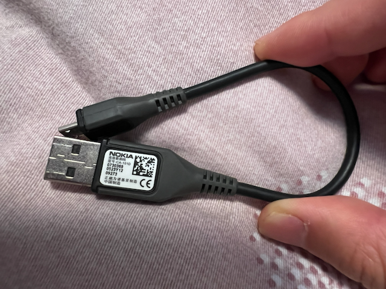
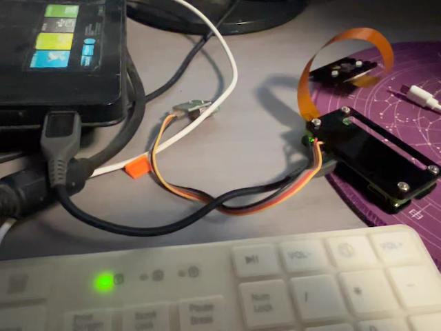
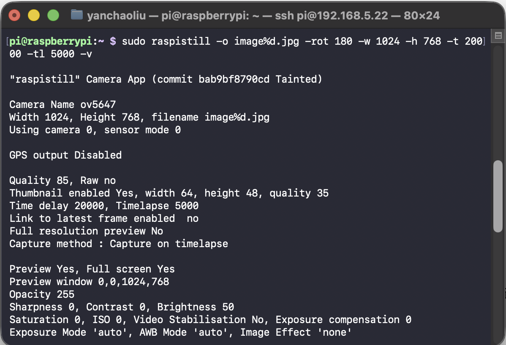
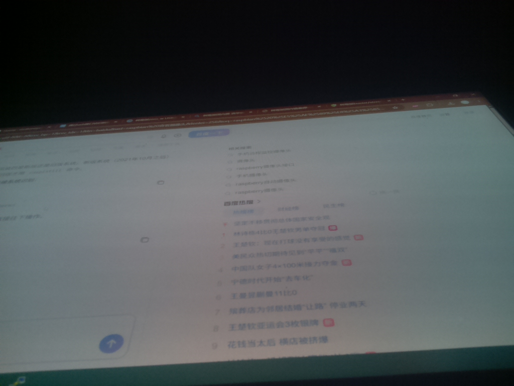

> 内存条比金子还贵

最近某个同事生日，想要一个桌面摄像头作为打卡设备作为生日礼物。于是去海鲜市场淘了一套树莓派zero w搭配ov5647摄像头和tf卡套装。可惜的是没有电源线和GPIO卡针。不过也已经够用了，卖家发货时预装了raspbian buster系统，还把wpa_supplicant预设了一个wifi名称和密码，更改家用Wi-Fi的名称和密码后可以直接连上。但是翻了一下我的库存之后，发现还有一个早年**诺基亚手机**的数据连接线：



于是开始折腾起来。经过一番搜索，我发现了一个[知乎上的帖子](https://zhuanlan.zhihu.com/p/1899117089966523506)和一个[博客园的帖子](https://www.cnblogs.com/haoyufang/p/12508244.html)，只需要这个数据线就可以连接和开机。当然这个博客园的帖子更加简洁，而且给了windows下驱动的资源。总结一下步骤：

> 1. 在boot分区下编辑config.txt 文件末尾增加一行 `dtoverlay=dwc2`
> 2. 在boot分区下编辑cmdline.txt 找到rootwait 在后面插入`modules-load=dwc2,g_ether`
> 3. 新建一个空文件名为ssh
> 4. Win10下载驱动 链接：https://pan.baidu.com/s/1OiVzhoujQHD4is-H4vr8gA 提取码：skkk [备用链接](https://flaredrive.liuyc.uk/raw/public/RPI_Driver_OTG.zip)
> 5. 插入树莓派到USB口，设备管理器里自动识别成串口，右键更新驱动，安装下好的驱动。
> 6. putty访问 pi@raspberrypi.local 端口22 输入密码raspberry

千万记得用数据线而不是电源线连靠近mini HDMI的接口，连接好后的状态如图：

通过ssh打开`/etc/wpa_supplicant/wpa_supplicant.conf`配置wifi网络类似格式如下：
```bash
network={
    ssid="ommo"
    psk="12345678"
    key_mgmt=WPA-PSK
}
```
然后重启就自动连接Wi-Fi网络了。此时就可以通过无线网来进行ssh访问了，输入`ip a`命令，记下IP地址即可。接下来测试摄像头，首先用`sudo raspi-config`选择Interface后打开camera，然后重启。

通过命令`lsb_release -a`来查看版本，因为这里预装了buster，所以摄像头的拍摄命令是`raspistill`，参考[这里](https://www.cnblogs.com/hzdx/p/raspberry_raspistill.html)使用下面的命令拍摄试一下：
```bash
sudo raspistill -o image%d.jpg -rot 180 -w 1024 -h 768 -t 20000 -tl 5000 -v
```
可以看到顺利输出：

最后是摄像头的拍摄图片：
